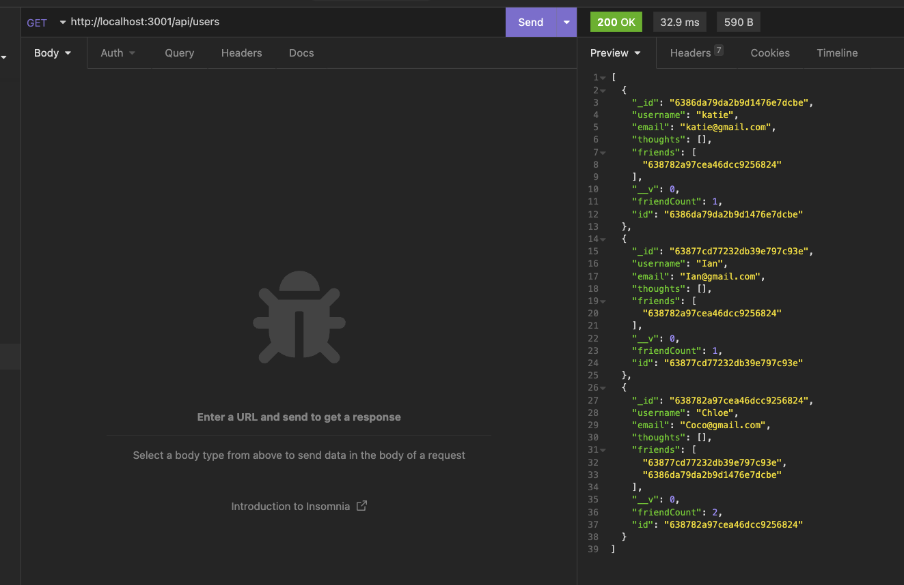

# NoSQL_Social_Network_API

## Description

Using MongoDB, I have built the back-end for a social media application where:
- users can be added, edited and deleted
- users can add and delete a friend
- users can post, edit and remove a thought
- users can add or remove a reaction

## Showcase

Please see the video below for an example of how this project works:

Here is an example of the GET route for users in Insomnia:

## What I learned

Throughout this project, I have become more comfortable with the flow of routes and the file structure. I gained some troubleshooting practice, as with most projects, and learned new ways to solve errors.

## Credits

Referenced previous class assignments and practices. 

## License

  
---
